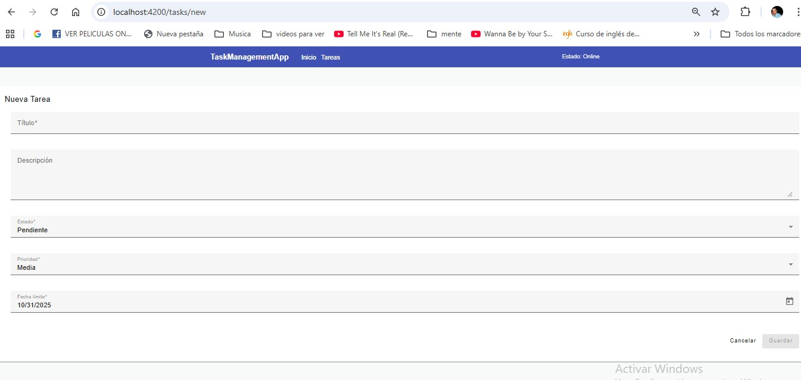
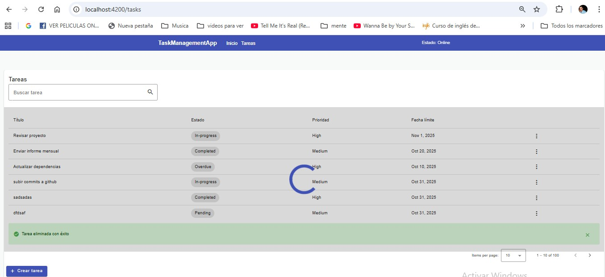
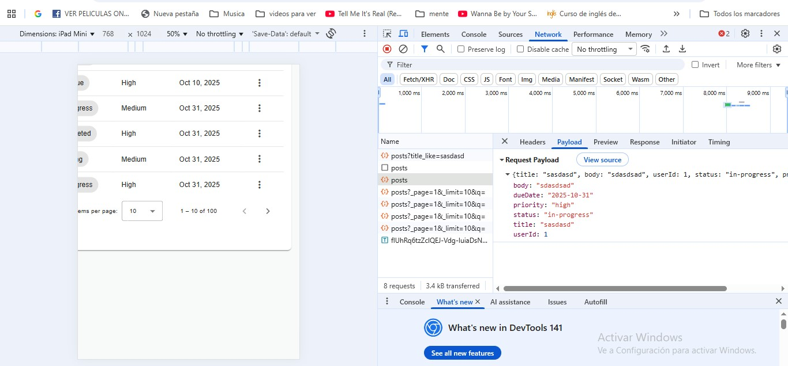
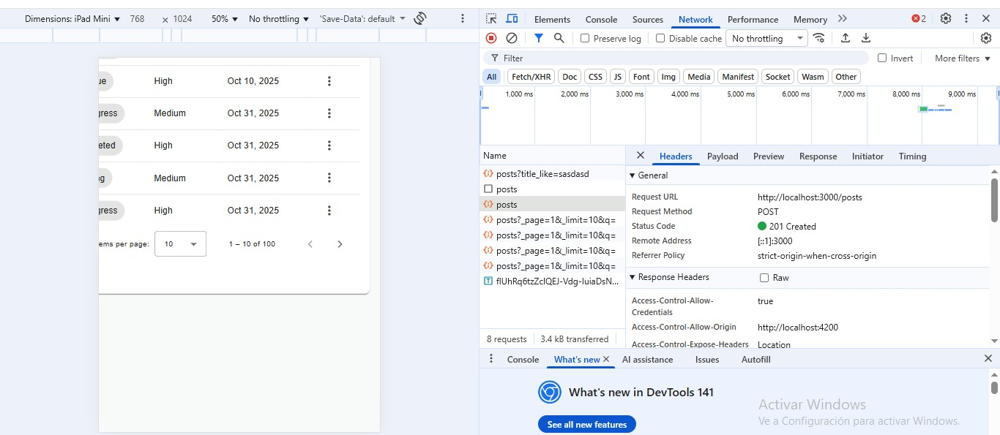
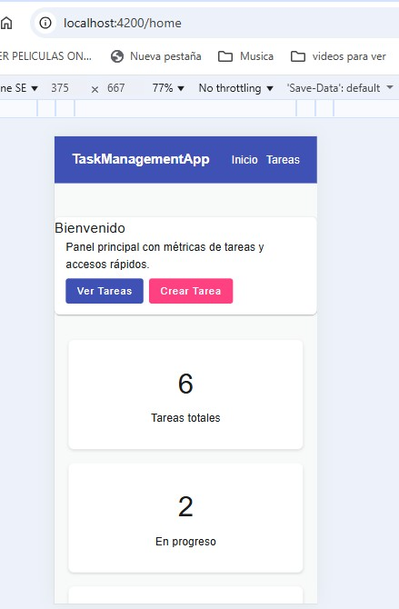

# Gestión de Tareas - Angular App

Aplicación de gestión de tareas desarrollada con Angular 16+ y Material Design. Permite crear, editar, eliminar y visualizar tareas, con un dashboard que muestra estadísticas mediante gráficos.

## Características principales

- ✨ Interfaz moderna con Angular Material
- 📱 Diseño responsive
- 📊 Dashboard con gráficos estadísticos
- ⚡ Componentes standalone
- 🔄 Gestión de estado con RxJS
- 🎨 Tema personalizado y animaciones

## Instalación y ejecución

### Requisitos previos
- Node.js 18+
- npm 9+
- Angular CLI 17+

### Pasos de instalación

1. Clonar el repositorio:
```bash
git clone <url-del-repo>
cd TaskManagementApp
```

2. Instalar dependencias:
```bash
npm install
```

3. Iniciar la aplicación:
```bash
# Terminal 1: Servidor de desarrollo
ng serve

# Terminal 2: API mock (opcional, para persistencia)
npm run serve:mock
```

4. Abrir el navegador en `http://localhost:4200`

## Estructura del proyecto

```
src/
├── app/
│   ├── core/              # Servicios e interceptores
│   ├── features/          # Módulos funcionales
│   │   ├── dashboard/     # Dashboard con gráficos
│   │   └── tasks/        # Gestión de tareas
│   └── shared/           # Componentes compartidos
```

## Capturas de pantalla

### Lista de Tareas

- Vista principal con tabla de tareas
- Filtrado y ordenación
- Acciones rápidas (editar/eliminar)

### Formulario de Tareas

- Formulario de creación/edición
- Validaciones en tiempo real
- Campos configurables

### Loading Spinner

- Indicador de carga durante operaciones
- Feedback visual para el usuario

### Network Payload

- Peticiones HTTP al backend
- Formato de datos y respuestas

### Network Post

- Peticiones HTTP al backend
- Formato de datos y respuestas

### Responsive Design

- Diseño responsive
- Adaptación a diferentes tamaños de pantalla

## Tecnologías utilizadas

- Angular 17
- Angular Material
- RxJS
- Chart.js
- TypeScript
- SCSS

## Decisiones Técnicas Clave

### Estrategia de Detección de Cambios OnPush

Se ha optado por la estrategia de detección de cambios `OnPush` en la mayoría de los componentes. Esto se hace para optimizar el rendimiento de la aplicación, ya que Angular solo verifica los cambios en un componente cuando:
- Alguna de sus `@Input()` properties cambia (por referencia).
- Se emite un evento desde el componente o alguno de sus hijos.
- Se ejecuta una operación asíncrona (como `setTimeout`, `Promise.resolve`, etc.) dentro del componente.
- Se invoca explícitamente `ChangeDetectorRef.detectChanges()` o `ChangeDetectorRef.markForCheck()`.

Esta estrategia reduce el número de veces que Angular necesita ejecutar el ciclo de detección de cambios, lo que resulta en una aplicación más rápida y eficiente, especialmente en aplicaciones grandes con muchos componentes.

### Interceptores HTTP

Se utilizan interceptores HTTP para manejar tareas comunes en las solicitudes y respuestas HTTP de manera centralizada. Esto incluye:
- **Manejo de errores:** Captura errores HTTP y los gestiona de forma global (por ejemplo, mostrando notificaciones o redirigiendo a una página de error).
- **Añadir cabeceras:** Incluir automáticamente cabeceras como tokens de autenticación (`Authorization`) o tipos de contenido (`Content-Type`) en todas las solicitudes salientes.
- **Indicadores de carga:** Mostrar y ocultar un spinner de carga global para proporcionar feedback visual al usuario durante las operaciones de red.

Los interceptores mejoran la modularidad y la reusabilidad del código, evitando la duplicación de lógica en cada servicio que realiza peticiones HTTP.

## Reporte de Cobertura

El proyecto está configurado para generar reportes de cobertura de código utilizando Karma y `karma-coverage`. Para generar el reporte, ejecuta el siguiente comando:

```bash
ng test --no-watch --code-coverage
```

Una vez finalizada la ejecución de las pruebas, el reporte de cobertura se encontrará en la carpeta `coverage/` en la raíz del proyecto. Puedes abrir `coverage/<project-name>/index.html` en tu navegador para visualizar el reporte detallado.

## Mejoras futuras

- Implementar autenticación
- Añadir filtros avanzados
- Exportación de datos
- Modo oscuro
- Notificaciones push
- Sincronización en tiempo real
- Integración con calendarios externos
- Más tipos de visualizaciones y reportes
- Personalización de temas
